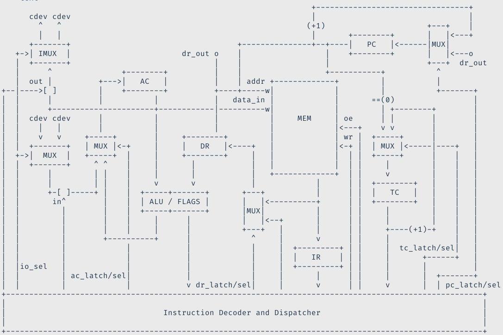

# Asm. Транслятор и модель.

* Кулаков Никита Васильевич, P33312
* `asm | acc | neum | hw | tick | struct | stream | port | prob2 `

## Язык программирования

BNF:

```ebnf
<program> ::= <EOF> | <section_list> <EOF>
<section_list> ::= <section> <section_list> | <section>
<section> ::= "section" <identifier> <line_list>
<line_list> ::= <line> <line_list> | <line>
<line> ::= <line_not_empty> | <line_not_empty> <EOL> | <EOL>
<line_not_empty> ::= <line_instruction> <comment> | <line_instruction> | <comment> | <section>
<line_instruction> ::= <label_decl> <instruction> | <label_decl> | <instruction>
<label_decl> ::= <label> ":"
<label> ::= <identifier>
<identifier> ::= <letter> | <letter> <letter_or_digit_list>
<comment> ::= ";" <char_not_eol_list>

<instruction> ::= <no_arg_instr> | <one_arg_instr>
<no_arg_instr> ::= <no_arg_op>
<one_arg_instr> ::= <one_arg_op> <operand>
<operand> ::= <indirect_operand> | <direct_operand>
<direct_operand> ::= <label> | <immediate>
<indirect_operand> ::= "[" <direct_operand> "]"
<immediate> ::= <int_lit> | <char_lit>

<int_lit> ::= <digit_list> | "-" <digit_list>
<digit_list> ::= <digit> <digit_list> | <digit>
<char_lit> ::= "'" <letter> "'" | "'" <digit> "'"

<letter_or_digit_list> ::= <letter_or_digit> | <letter_or_digit> <letter_or_digit_list>
<letter_or_digit> ::= <letter> | <digit>
<char_not_eol_list> ::= <letter_digit_space> | <letter_digit_space> <char_not_eol_list>
<letter_digit_space> ::= <letter> | <space>
<space> ::= " " | "\t"
<letter> ::= [a-z] | [A-Z]
<digit> ::= [0-9]
<EOF> ::= "1A"
<EOL> ::= "\n"

<no_arg_op> ::= "inc" | "dec" | "itoc" | "ctoi" | "halt"
<one_arg_op> ::= "add" | "sub" | "div" | "mod" | "mul" | "ld" | "st" | "cmp" | "je" | "jne" | "js" | "jmp" | "in" | "out"
```

### Секции

- `section <name>` - создать секцию с именем `<name>`. Данные внутри секций идут последовательно.
- `.text` - секция для кода
- `.data` - секция для данных

### Метки
- `label:` - метка (для выполнения иструкций перехода);
- `_start:` - обязательная метка, сигнализирующая начало программы, может находиться где угодно, главное чтобы указывала на инструкцию;
- На одни и те же инструкции (команды и данные) могут быть указаны несколько меток, однако метки не могут дублироваться и одни, и те же метки указывать на разные инструкции;
- Область видимости глобальная;

### Команды

* `inc` - инкрементировать значения в аккумуляторе.

| Instruction | Description  |
|-------------|--------------|
| `inc`       | AC := AC + 1 |

* `dec` - декрементировать значение в аккумуляторе.

|Instruction|Description |
|-----------|------------|
|`dec`      |AC := AC - 1|

* `itoc` - перевести integer в код символа ASCII.

|Instruction|Description        |
|-----------|-------------------|
|`itoc`     |AC := AC + ord('0')|

* `ctoi` - перевести код символа ASCII в integer.

|Instruction|Description        |
|-----------|-------------------|
|`itoc`     |AC := AC - ord('0')|

* `add` - сложить значение в аккумуляторе с операндом.

|Instruction|Description     |
|-----------|----------------|
|`add m32`  |AC := AC + m32|
|`add imm32`|AC := AC + imm32|

* `sub` - вычесть значение в аккумуляторе с операндом.

|Instruction|Description     |
|-----------|----------------|
|`sub m32`  |AC := AC - m32|
|`sub imm32`|AC := AC - imm32|

* `div` - беззнаковое деление.

|Instruction|Description     |
|-----------|----------------|
|`div m32`  |AC := AC / m32|
|`div imm32`|AC := AC / imm32|

* `mod` - остаток от беззнакового деления.

|Instruction|Description     |
|-----------|----------------|
|`mod m32`  |AC := AC % m32|
|`mod imm32`|AC := AC % imm32|

* `mul` - беззнаковое умножение.

|Instruction|Description     |
|-----------|----------------|
|`mul m32`  |AC := AC * m32|
|`mul imm32`|AC := AC * imm32|

* `ld` - загрузить значение в аккумулятор (флаги не выставляются).

|Instruction|Description|
|-----------|-----------|
|`ld m32`   |AC := m32  |
|`ld imm32` |AC := imm32|

* `st` - загрузить значение в ячейку из аккумулятора.

|Instruction|Description  |
|-----------|-------------|
|`st imm32` |\*imm32 := AC|

* `cmp` - сравнить числа. Работает как `sub`, однако значение в аккумуляторе не модифицируется.

| Instruction | Description |
|-------------|-------------|
| `cmp m32`   | AC - m32    |
| `cmp imm32` | AC - imm32  |

* `je` - переход, если равно.

|Instruction|Description   |
|-----------|--------------|
|`je imm32` |Jump if equals|

* `jne` - переход, если не равно.

|Instruction|Description|
|-----------|-----------|
|`jne imm32`|           |

* `js` - переход, если знак (отрицательное число).

|Instruction|Description|
|-----------|-----------|
|`js imm32`|           |

* `jmp` - безусловный переход.

|Instruction|Description|
|-----------|-----------|
|`jmp imm32` |           |

* `in` - считать байт с порта в младший байт аккумулятора.

|Instruction|Description|
|-----------|-----------|
|`in imm32` | `imm32` - номер порта |

* `out` - записать младший байт аккумулятора на порт.

|Instruction|Description|
|-----------|-----------|
|`out imm32` | `imm32` - номер порта |

* `halt` - остановка программы.

|Instruction|Description|
|-----------|-----------|
|`halt`     |           |

#### Примечание
* `m32` - адрес в памяти, из которого мы берем значение. Здесь также можно использовать метки, поскольку в отличие от обычного `asm` в данной ЛР они имеют абсолютный адрес. Синтаксически на asm:
* `imm32` - неизменяемое число, будь то константа или адрес метки, который может быть получен во время генерации кода.
```asm
cmd [label] ; [label] - m32
cmd label ; label - imm32

cmd - команда
```

* Реализована возможность имплементации команд с несколькими аргументами

### Комментарии
* `; здесь комментарий` - однострочный комментарий до конца строки

### Константы
* `cmd/var: <int_lit>` - команда с аргументом или переменная с целочисленным значением
* `cmd/var: '<char_lit>'` - символ ASCII. Поддерживаются управляющие символы `\n`, `\q`, `\r`, `\t`.

### Массивы

* Не реализованы.

## Организация памяти

### Работа с памятью

Модель памяти процессора (фон-Неймана):

1. Память команд и данных. Машинное слово -- 32 бит, знаковое. Линейное адресное пространство. Реализуется списком чисел и инструкций, идущих друг за другом с интервалом в 32 бита.

2. Отдельного разделения на память команд и данных нет. При попытке исполнения иструкции переменной программа падает на исключении (так сказать лимитации json).

3. Scope в языке глобальный, вся память является статической.


### Модель памяти

1. Размер машинного слова - 32 бит. Адресация абсолютная, поскольку нет ограничения на размер регистра из-за представления struct.

2. Структура памяти однородная, так как port-mapped. Запись на порт осуществляется посредством отдельных команд.

3. Пользователю доступен только аккумуляторный регистр.

### Отображение конструкций языка на модель памяти процессора

* Память отображается модулем, генерирующим код, статически. Инструкции не перемешиваются. Пробелов между инструкциями нет. Каждая инструкция занимает 1 машинное слово.

```text
     Memory (for data and instructions)
+-----------------------------+
|    ...                      |
| 0x00: var1                  | <- var_label: value1
| 0x20: cmd1                  | <- cmd1: args
| 0x40: cmd2                  | <- cmd2: args
| 0x60: var2                  | <- var_label: value2
|    ...                      |
+-----------------------------+
```

## Система команд

Особенности процессора:

* Машинное слово -- 32 бит, знаковое.
* Память данных и команд:
    * Адресуется через регистр data_register, program_counter.
    * Может быть записана из аккумулятора.
    * Может быть прочитана в регистр data_register или instruction_register.
* Ввод-вывод - port-mapped. Осуществляется посредством взаимодействия с accumulator. Номер порта - контанта.
* Program_counter - счетчик команд. Инкрементируется с каждой инструкцией, может быть перезаписан командой перехода.
* Tick_counter - счетчик номера такта с начала обработки инструкции.
* Инструкции обрабатываются последовательно друг за другом. У каждой иструкции есть этапы FETCH, DECODE, EXECUTE.
* Прерываний нет.
* Машина поддерживает только абсолютную адресацию.
* Присутствуют флаги Z(zero), N(neg) для команд перехода.


### Набор инструкции

* Комментарии по командам выше. Одинаковые команды имеют разный опкод в зависимости от принимаемых аргументов. Аргументы бывают `Indirect`, `Direct`.

* Реализуется в модуле [isa](./isa.py).

|Syntax       |Mnemonic |Кол-во тактов|Comment|
|-------------|---------|-------------|-------|
|`inc`        |`inc`    |3            |  -    |
|`dec`        |`dec`    |3            |  -    |
|`itoc`       |`itoc`   |3            |  -    |
|`ctoi`       |`ctoi`   |3            |  -    |
|`add <m32>`  |`add_m`  |4            |  -    |
|`add <imm32>`|`add_imm`|3            |  -    |
|`sub <m32>`  |`sub_m`  |4            |  -    |
|`sub <imm32>`|`sub_imm`|3            |  -    |
|`div <m32>`  |`div_m`  |4            |  -    |
|`div <imm32>`|`div_imm`|3            |  -    |
|`mod <m32>`  |`mod_m`  |4            |  -    |
|`mod <imm32>`|`mod_imm`|3            |  -    |
|`mul <m32>`  |`mul_m`  |4            |  -    |
|`mul <imm32>`|`mul_imm`|3            |  -    |
|`ld <m32>`   |`ld_m`   |4            |  -    |
|`ld <imm32>` |`ld_imm` |3            |  -    |
|`st <m32>`   |`st_imm` |3            |  -    |
|`cmp <m32>`  |`cmp_m`  |4            |  -    |
|`cmp <imm32>`|`cmp_imm`|3            |  -    |
|`je <imm32>` |`je`     |3            |  -    |
|`jne <imm32>`|`jne`    |3            |  -    |
|`js <imm32>` |`js`     |3            |  -    |
|`jmp <imm32>`|`jmp`    |3            |  -    |
|`in <imm32>` |`in_imm` |3            |  -    |
|`out <imm32>`|`out_imm`|3            |  -    |
|`halt`       |`halt`   |3            |  -    |

* Примечание: лишний такт для некоторых команд, работающих с прямыми адресами, наблюдается из-за декодирования операндов инструкции.

#### Этапы инструкций

* `FETCH` - 1 такт
* `DECODE` - 1 или более тактов
* `EXECUTE` - 1 или более тактов (условимся что 1 на все операции, даже `div`, `mul`)

### Кодирование инструкций

- Машинный код сериализуется в список JSON.
- Один элемент списка, одна инструкция.
- Адрес инструкции -- индекс списка + `base_address`. Используется для команд перехода и выбора следующей инструкции.

Пример:

* Variable:
```json
{
  "address": 0,
  "value": 2
}
```

* Instruction:
```json
{
  "address": 608,
  "args": [
    64
  ],
  "opcode": "st_imm"
}
```
где:
* `address` - адрес, по которому в памяти расположена данная инструкция;
* `value` - значение переменной;
* `args` - аргументы команды, соответствующие opcode;
* `opcode` - код операции;

Все команды десериализуются в `class Instruction`, определенный в модуле [isa](./isa.py).

## Транслятор

* Интерфейс командной строки: `translator.py <input_file> <target_file>`

* Реализовано в модуле: [translator](./translator.py).

* Этапы трансляции (функция translate):
    * Токенизирование: преобразование исходного кода в последовательность лексем (`LexerNode`).
    * Парсинг: на основании токенов строится дерево AST. Парсер умеет бросать ошибки и намекать, в чем проблема, в случае невалидных исходников (`class Parser`).
    * Проверка дерева парсер на соответствие аргументов инструкций и наличия самих инструкций в словаре `ISACommands`, типа инструкций в соответствующих секциях (так в секции `.data` нельзя определить команду), проверка границ чисел.
    * Генерация машинного кода на основании дерева AST парсера.

* Парсер и лексер реализуют обработку исходных кодов в соответствие с `ebnf`;

* Один символ языка -- одна инструкция;

* Инструкции и их аргументы прямо отображаются на опкод.

### Генерируемый формат лексера

```
[
    {
        "ltype": "EOL",
        "off": 18,
        "raw": "\n"
    },
    {
        "ltype": "Identifier",
        "off": 19,
        "raw": "_start"
    },
    {
        "ltype": "Syntax",
        "off": 25,
        "raw": ":"
    },
    {
        "ltype": "EOF",
        "off": 26,
        "raw": null
    }
]

```

### Генерируемый формат парсера

```
{
  "type": "Program",
  "sections": [
    {
      "type": "Section",
      "value": ".text",
      "instructions": [
        {
          "type": "Command",
          "labels": [
            "_start"
          ],
          "cmd": "ld",
          "args": [
            {
              "type": "DirectArgument",
              "value": 0
            }
          ]
        },
        {
          "type": "Command",
          "labels": [
            ".loop"
          ],
          "cmd": "in",
          "args": [
            {
              "type": "DirectArgument",
              "value": 0
            }
          ]
        },
        {
          "type": "Command",
          "labels": [],
          "cmd": "out",
          "args": [
            {
              "type": "DirectArgument",
              "value": 1
            }
          ]
        },
        {
          "type": "Command",
          "labels": [],
          "cmd": "jmp",
          "args": [
            {
              "type": "DirectArgument",
              "value": ".loop"
            }
          ]
        }
      ]
    }
  ]
}
```


### Формат ошибки парсера
```
Exception: Parser
{
  "type": "Error",
  "context": "Program",
  "childs": [
    {
      "type": "Error",
      "context": "Section",
      "childs": [
        {
          "type": "Error",
          "context": "Keyword",
          "message": "Got Identifier",
          "lexem": {
            "ltype": "Identifier",
            "off": 19,
            "raw": "_start"
          }
        }
      ]
    }
  ]
}
```

## Модель процессора

### Схема DataPath and ControlUnit

* IR - Instruction Register
* TC - Tick Counter
* PC - Program Counter
* IMUX - Inverse Multiplexor
* MUX - Multiplexor
* AC - Accumulator
* MEM - main memory
* cdev(in/out) - character device
* FLAGS - (N - negative, Z - zero)

#### Изображение


#### Текстовое
``` text                                                        
                                                                   +---------------------------------+       
      cdev cdev                                                    |                                 |       
        ^   ^                                                     (+1)                      +---+    |       
        |   |                                                      |       +--------+       |   |<---+       
      +-------+                                    +---------------+--+----|   PC   |<------|MUX|            
      | IMUX  |                        dr_out o    |                  |    +--------+       |   |<---o       
   +->+-------+                               |    |                  |                     +---+  dr_out    
   |      ^               +--------+          |    |                  +-----------+           ^              
   |  out |          +--->|   AC   |          |    | addr +-------------+         |           |              
+--|---->[ ]         |    +--------+          +----+----->|             |         |           +-------+      
|  |      |          |           |            |   data_in |             |       ==(0)                 |      
|  |      +----------------------+------------|---------->|             |         | +--------+        |      
|  |  cdev cdev      |           |            |           |     MEM     | oe      | |        |        |      
|  |    |   |        |           |            |           |             |<---+    v v        |        |      
|  |    v   v     +-----+        |     +--------+         |             | wr |  +-----+      |        |      
|  |  +-------+   | MUX |<-+     |     |   DR   |<----+   |             |<-+ |  | MUX |<-----|----+   |      
|  +->|  MUX  |   +-----+  |     |     +--------+     |   |             |  | |  +-----+      |    |   |      
|  |  +-------+     ^ ^    |     |       |            |   |             |  | |     |         |    |   |      
|  |      |         | |    |     |       |            |   +-------------+  | |     v         |    |   |      
|  |      |         | |    |     v       v            |             |      | |  +--------+   |    |   |      
|  |      +-[ ]-----+ |    |  +-----+-------+       +---+           |      | |  |   TC   |   |    |   |      
|  |       in^        |    |  | ALU / FLAGS |       |   |<----------+      | |  +--------+   |    |   |      
|  |         |        |    |  +-----+-------+       |MUX|           |      | |     |         |    |   |      
|  |         |        |    |     |      |           |   |<--+       |      | |     |         |    |   |      
|  |         |        |    |     |      |           +---+   |       |      | |     +----(+1)-+    |   |      
|  |         |        +----------+      |             ^     |       v      | |     |              |   |      
|  |         |             |            |             |     |  +---------+ | |     |  tc_latch/sel|   |      
|  |         |             |            |             |     |  |   IR    | | |     |       +------+   |      
|  |io_sel   |             |            |             |     |  +---------+ | |     |       |          |      
|  |         | ac_latch/sel|            |             |     |       |      | |     |       |  +-------+       
|  |         |             |            v dr_latch/sel|     |       |      | |     |       |  | pc_latch/sel 
+-------------------------------------------------------------------------------------------------------+
|                                                                                                       |
|                                  Instruction Decoder and Dispatcher                                   |
|                                                                                                       |
+-------------------------------------------------------------------------------------------------------+
```

### DataPath


### ControlUnit


## Апробация

В качестве тестов использованы алгоритмы:

1. fdskfaj

Интеграционные тесты: [integration_test]()

CI (Github):

``` yaml
# ./github/workflows/ci.yml
docker-test:
  name: Run tests & display coverage on Docker
  runs-on: ubuntu-latest
  container: zubrailx/ca-lab3:first
  steps:
    - uses: actions/checkout@v3
      with:
        fetch-depth: '1'

    - name: Test
      run: |
        ./test-run.sh


# ./test-run.sh
coverage run -m pytest --verbose
find src test -type f -name "*.py" | xargs -t python3 -m coverage report
find src test -type f -name "*.py" | xargs -t python3 -m pycodestyle --ignore=E501
find src test -type f -name "*.py" | xargs -t python3 -m pylint
```

где:

- `coverage` -- формирование отчёта об уровне покрытия исходного кода.
- `pytest` -- утилита для запуска тестов.
- `pep8` -- утилита для проверки форматирования кода. `E501` (длина строк) отключено, но не следует этим злоупотреблять.
- `pylint` -- утилита для проверки качества кода. Некоторые правила отключены в отдельных модулях с целью упрощения кода.
- Docker image `python-tools` включает в себя все перечисленные утилиты. Его конфигурация: [Dockerfile](./Dockerfile).

Пример использования и журнал работы процессора на примере `cat`:

``` console
```

| ФИО           | алг.  | LoC       | code байт | code инстр. | инстр. | такт. | вариант |
|---------------|-------|-----------|-----------|-------------|--------|-------|---------|
| Преподавателя | hello | ...       | -         | ...         | ...    | ...   | ...     |

```
add imm:

1) mem[pc] -> ir, pc = pc + 1, tc = 0
2) (ir, tick) -> decoder -> dr, tick += 1
3)  alu(acc, dr) -> acc, tick += 1

add m:

1) mem[pc] -> ir, pc = pc + 1, tc = 0
2) (ir, tick) -> decoder -> dr, tick += 1
3) mem[dr] -> dr, tick += 1
3)  alu(acc, dr) -> acc, tick += 1

```
