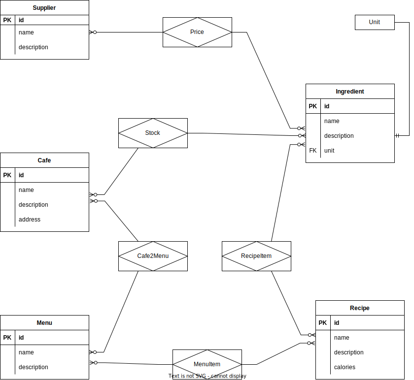

# Этап 1

## Описание предметной области

В мире существует множество кофеен, которые объединяются в целые сети. Владельцам таких заведений нужно иметь возможность мотиторить их состояние и управлять ими, а покупателям (которые знают SQL, конечно же) всегда удобнее, когда у кофейни доступно актуальное меню в виде БД!

Без такой системы владельцы тратят миллионы на товары, которые в конце концов будут выброшены, так как успели просрочится. А покупателям приходится неделями стоять в очереди за любимым блюдом иил напитком, в ожидании того, что кофейня закупит нужные ингредиенты.

## Описание бизнес процессов

Владелец может для каждой конкретной кафешки записывать доступное количество ингредиентов, изменять его при использовании ингредиентов, смотреть цены на разные товары у поставщиков, пополнять запасы.

Владелец может создавать меню с различными блюдами, привязанными к конкретному заведению и менять их в зависимости от необходимости. Эти меню будут видны и покупателям.

Продавцы продуктов могут выставлять свои товары, которые будут доступны для покупки в любом заведении, подключенном к этой системе.

## Список сущностей и их классификации

#### Стержневые сущности:
* Поставщик товаров (название, описание)
* Кафе (адрес, комментарий)
* Меню (название, комментарий)
* Рецепт (название, описание, информация о питательных свойствах)
* Ингредиент (название, комментарий, еденицы изменения)

#### Ассоциативные сущности:
* Цена ингредиента (количество, цена за единицу) - Поставщик M-M Ингредиент
* Ингредиент рецепта (количество, обязательность) - Рецепт M-M Ингредиент
* Запас продукта (количество, срок годности, дата покупки) - Кафе M-M Ингредиент
* Меню кафе - Кафе М-М Меню
* Пункт меню (цена) - Меню М-М Рецепт

#### Характеристические сущности:
* Единицы измерения (название) - к ингредиентам

> Характеристическая сущность (характеристика) — связь
вида "многие-к-одной" или "одна-к-одной" между двумя
сущностями (частный случай ассоциации). Цель
характеристики - описание или уточнении некоторой
другой сущности.

# Этап 2

## Инфологическая модель

## Даталогическая модель

